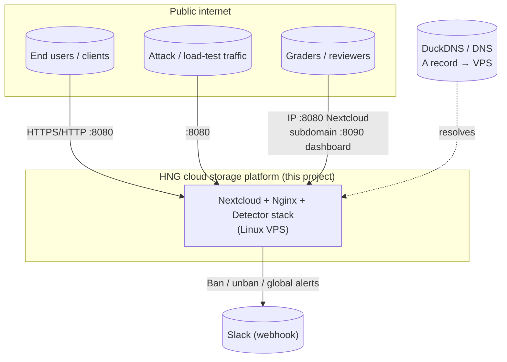
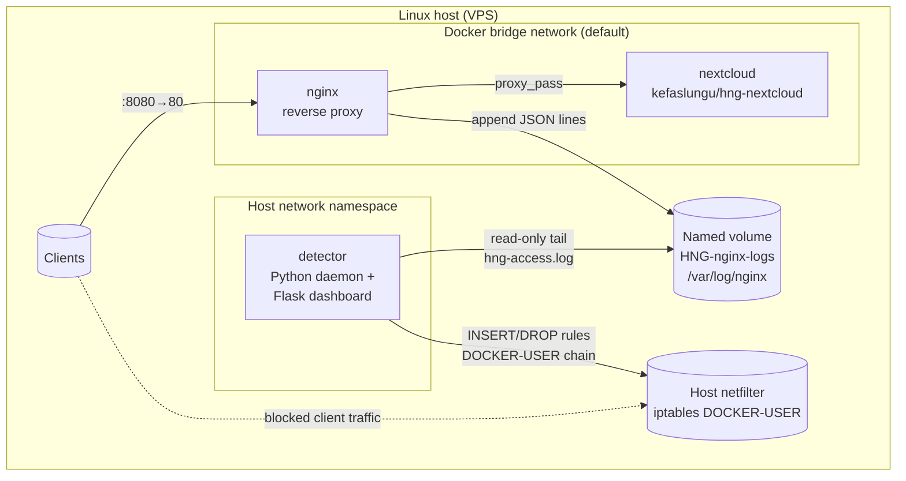
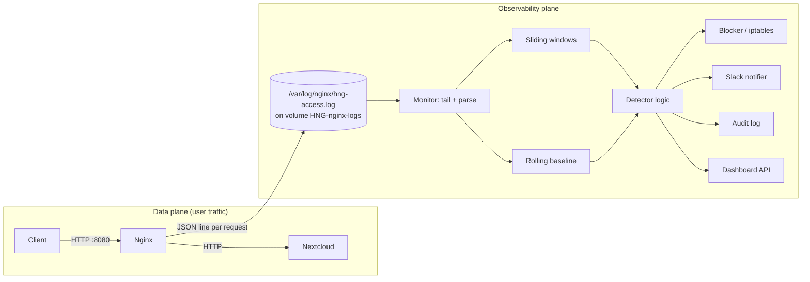
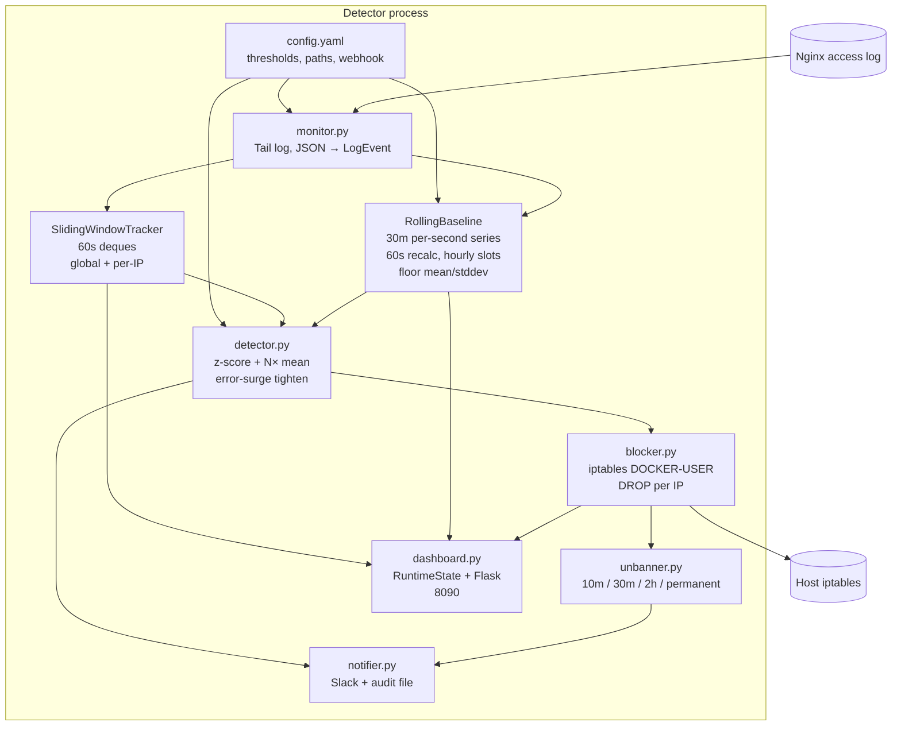
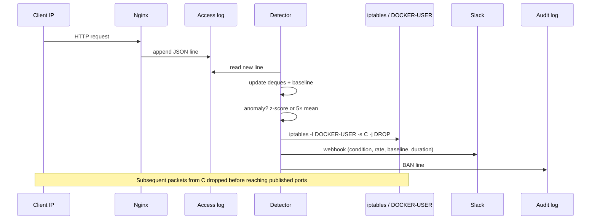
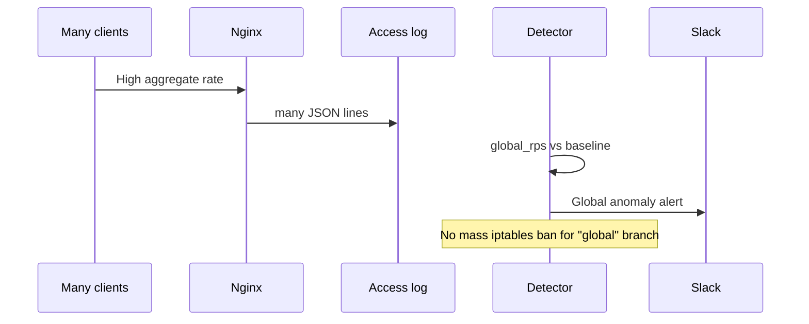
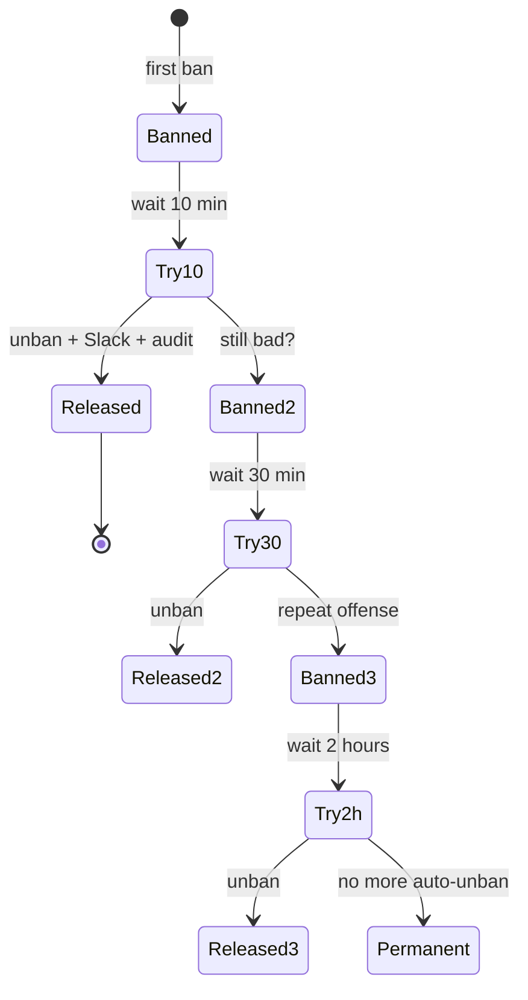

# System architecture — HNG anomaly detection & Nextcloud stack

This document describes the full system: who talks to what, how data moves, and how the detector fits beside the prebuilt Nextcloud image. Use the Mermaid diagrams in [Mermaid Live](https://mermaid.live) or a VS Code Mermaid extension to export **`architecture.png`** for the brief.

---

## 1. Problem space (one paragraph)

Users reach **Nextcloud** over the public internet. **Nginx** terminates HTTP, logs every request as **JSON** to a shared volume. A **Python detector** tails that log, maintains **sliding windows** and a **rolling baseline**, flags **anomalies**, may add **host `iptables` rules** (per-IP), sends **Slack** alerts, writes an **audit log**, and serves a **live dashboard** (subdomain in production). The official Nextcloud image is **not** modified; all custom logic lives in Nginx config + the detector.

---

## 2. C4 Level 1 — System context

External actors and the system boundary.

**Notes**

- **:8080** = Nginx front door to Nextcloud (as in your compose).
- **:8090** = detector dashboard (host network in your design).
- Graders may hit **IP** for Nextcloud and a **hostname** for the dashboard per brief.

---

## 3. C4 Level 2 — Containers (Docker Compose)

Logical processes and data stores on one VPS.

**Why two network modes?**

- **Nginx + Nextcloud** use normal bridge networking so port **8080:80** mapping works as expected.
- **Detector** uses **`network_mode: host`** plus **`NET_ADMIN`** so `iptables` commands affect the **real host** (rules visible in `iptables -L` for grading). The dashboard listens on **8090** on the host.

---

## 4. Request path vs observability path

Two orthogonal flows: **user data** vs **telemetry**.

---

## 5. Detector — internal components

Maps to your `detector/` modules.

---

## 6. Sequence — per-IP anomaly to ban

---

## 7. Sequence — global anomaly (alert only)

---

## 8. Unban backoff

(Exact timings match your `unbanner.py` config.)

---

## 9. Deployment & ports (reference)

| Surface | Port | Purpose |
|--------|------|--------|
| Host | **22** | SSH |
| Host | **8080** | Published **Nginx → Nextcloud** |
| Host | **8090** | **Detector dashboard** (Flask, host network) |
| Host | **80** | Optional host Nginx proxy to dashboard hostname |
| Internal | Nextcloud **expose 80** | Only reachable from Nginx on Docker network |

---

## 10. Shared volume contract

| Path in containers | Writer | Readers |
|-------------------|--------|---------|
| `/var/log/nginx/hng-access.log` | **nginx** | **detector** (tail, RO mount), **nextcloud** RO (per brief parity) |

Volume name: **`HNG-nginx-logs`**.

---

## 11. Security & trust boundaries

- **Real client IP**: Nginx trusts `X-Forwarded-For` (tune `set_real_ip_from` in production to known proxies only).
- **Blocking**: Only **per-IP** path adds host firewall rules; **global** anomaly does not blanket-ban.
- **Privilege**: Detector container is **privileged** + **NET_ADMIN** by design so host `iptables` matches grading expectations; minimize exposure (firewall only SSH + needed ports on cloud).

---

## 12. Exporting `architecture.png`

1. Open [Mermaid Live Editor](https://mermaid.live).
2. Paste **one** diagram at a time (Context or Container is best for a single poster image).
3. Export PNG.
4. Save as `docs/architecture.png` (or combine panels in any image editor).

Alternatively use **mermaid-cli** (`mmdc`) in CI to render from this file.

---

## 13. Diagram checklist for reviewers

- [ ] External users → Nginx :8080 → Nextcloud
- [ ] Nginx → JSON log → shared volume
- [ ] Detector tails log, updates windows/baseline, decides anomalies
- [ ] Per-IP → `iptables` + Slack + audit
- [ ] Global → Slack only
- [ ] Dashboard on :8090 (and optional hostname on :80)

This matches the HNG brief and your Compose layout.
